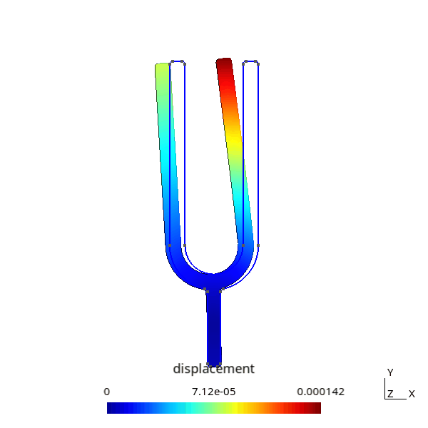

# LINMA1170 - Analyse numérique
## Project 3

## How to use [analysis.py](analysis.py)
First you need to compile and run the main program (`./deformation`) with the `DEV_3_LOG` macro constant on. Then you can run `analysis.py` with the following arguments:
- `energy`: this displays the potential, kinetic and total energy of the tuning fork. 
    - if a second argument is set, it will be used as the fraction of the time where the plot will start at.
    - if a third argument is set, it will be used as the fraction of the time where the plot will end at.
- `animation`: it needs two other arguments, the dt and T used. It's also important beforehand to have ran `deformation` with the `GIF` macro constant on. I recommand doing so with a small T~1 and dt>=1e-3. It will save an animation of the displacement of the tuning fork like below.
- `frequency`: it needs two other arguments, the "time" file and `I`. It plots a graph and displays some info about the frequencies of the displacement.
- `state`: it needs two other arguments, the "time" file and `I`. It displays a gif of the trajectory of a singular node like you can see below. You can optionally save the gif. Disclaimer: it takes a really long time.
- `sound`: it needs another argument, the "time" file. It finds and saves as a sound the peaks of frequency made by the displacement of some node.

## Results

### [Animated tuning fork](animations_et_sons/animation.gif)

### [Position of some node over time](animations_et_sons/state_93.gif)

### [Sound produced](animations_et_sons/tuning_fork.wav)
